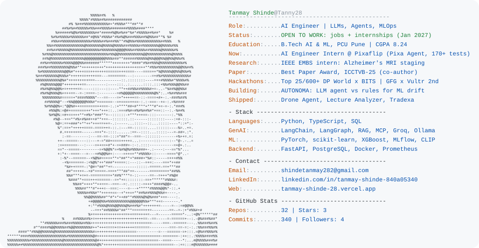

<a href="https://tanmay-shinde-28.vercel.app">
  <picture>
    <source media="(prefers-color-scheme: dark)" srcset="dark_mode.svg">
    
  </picture>
</a>

### Featured work
| Project | What it does |
|---|---|
| [**AUTONOMA**](https://github.com/Tanny28/autonoma) | Tests whether an LLM agent diagnoses ML model degradation better than rules (final-year project, team of 4) |
| [**Drone Security Analyst Agent**](https://github.com/Tanny28/flyt_assign) | VLM captions + CLIP search + rule-based alerts + LangChain agent. 5/5 on the FlytBase eval, 8/8 tests |
| [**Smart Lecture Analyzer**](https://github.com/Tanny28/smart-lecture-analyzer) | Lecture video to chapters, transcript, MCQs and a PDF study guide ([live](https://smart-lecture.streamlit.app)) |
| [**Alzheimer's MRI staging**](https://github.com/Tanny28/aso-alzheimer-staging) | CNN-feature fusion with leakage-safe subject splits: macro-AUC 0.81 on unseen patients |
| [**Pixa Agent**](https://github.com/WisdomBoost-LLC/PixaAgent) | Open-source AI coding agent for VS Code, 8,000+ lines of TypeScript, 170+ tests |
